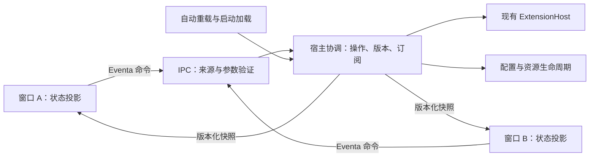

建议保留 Electron 主进程中的 `ExtensionHost`，在现有宿主边界集中管理启停操作、版本化状态和窗口订阅，逐步调整结构。当前已有检查页、状态查询及启停接口；新增需求主要改变的是**多窗口一致性、并发操作和来源授权**。目前没有足够证据支持直接迁移到独立插件进程。

以下默认“启停”指插件运行时的加载与卸载，“启用”指持久化的启动配置；能力状态用于观察。若需求还包括单独关闭某项能力或撤销权限，需要另行定义能力与插件、模块、会话的归属关系。

**当前已有能力与边界**

检查基于仓库 HEAD `5228f9412` 的入口、实现、测试、配置和相关历史。下面的事实可信度高；竞态属于代码路径推断，尚未执行复现。

| 核对项 | 可检查证据 | 对新增需求的影响 |
|---|---|---|
| 已有共享检查页和桌面 bridge | [检查页](/evaluation-path/repository/packages/stage-pages/src/pages/devtools/plugin-host.vue:92)、[Inspector Store](/evaluation-path/repository/packages/stage-ui/src/stores/devtools/plugin-host-debug.ts:81) | 可以复用界面和运行时注入边界。Store 在挂载、手动刷新及操作后更新，没有在这条路径订阅宿主状态变化。 |
| Host 在主进程组合；管理操作已有 Eventa 合约 | [组合入口](/evaluation-path/repository/apps/stage-tamagotchi/src/main/index.ts:176)、[IPC facade](/evaluation-path/repository/apps/stage-tamagotchi/src/main/services/airi/plugins/index.ts:47) | 主进程已有权威状态位置。多窗口不需要各自创建 Host。 |
| `enabled` 与 `loaded` 独立 | [宿主操作](/evaluation-path/repository/apps/stage-tamagotchi/src/main/services/airi/plugins/host/index.ts:447) | `setEnabled(false)` 不会调用卸载；`load` 也不要求已启用。新增界面不能把这两个状态合成一个开关而暗改旧语义。 |
| 加载检查发生在异步启动之前 | [加载与停止](/evaluation-path/repository/apps/stage-tamagotchi/src/main/services/airi/plugins/host/index.ts:343)、[自动重载](/evaluation-path/repository/apps/stage-tamagotchi/src/main/services/airi/plugins/features/auto-reload/index.ts:78) | 两次加载可能都通过 `loaded.has` 检查。自动重载的防重入集合只协调自动重载，未覆盖手动操作。 |
| 能力注册表按全局 `key` 保存 | [DependencyService](/evaluation-path/repository/packages/plugin-sdk/src/plugin-host/runtimes/shared/services/dependencies.ts:16)、[renderer 发布](/evaluation-path/repository/apps/stage-tamagotchi/src/renderer/App.vue:233) | 当前状态没有发布窗口归属；renderer 初始化路径会注册 provider 查询并报告 ready。增加观察窗口时，需要区分观察者与能力发布者。 |
| 检查与持久化都有额外语义 | [检查快照](/evaluation-path/repository/apps/stage-tamagotchi/src/main/services/airi/plugins/host/debug.ts:35)、[配置保存](/evaluation-path/repository/apps/stage-tamagotchi/src/main/libs/electron/persistence.ts:80) | 完整检查可能创建资源会话，且异步组装各部分；配置更新是节流异步保存，失败只记录日志。它们不能直接承担“纯状态订阅”和“已可靠落盘”的承诺。 |
| 已有生命周期测试，但没有验证真实多窗口路由 | [宿主测试](/evaluation-path/repository/apps/stage-tamagotchi/src/main/services/airi/plugins/index.test.ts:66) | 测试覆盖加载失败、自动重载、能力变化和资源清理；Electron adapter 被替换成内存 context，不能据此证明跨窗口广播或响应隔离。 |

还有两处需要避免把设计意图当成现状：

- [能力编排文档](/evaluation-path/repository/packages/plugin-sdk/docs/design/capability-orchestration.md:184)仍标为 **Proposed**。当前 SDK 会话阶段是 `setting-up / ready / failed / stopped`，已有能力快照和等待原语，但不能宣称完整的 `waiting-deps` 状态机已实现。历史提交 `668440a73` 也显示 Host 经历过较大改写。
- [当前加载器](/evaluation-path/repository/packages/plugin-sdk/src/plugin-host/runtimes/node/loaders/fs.ts:72)直接导入并运行插件。权限检查约束 SDK 调用，不构成任意插件代码的进程隔离。

**方案比较**

建议优先级为：操作安全与状态一致性 → 故障恢复与可诊断性 → 兼容性 → 实现成本。观察窗口可以短暂延迟，但不能覆盖较新状态；相同插件不能出现重叠生命周期副作用。

| 方案 | 形态与收益 | 代价、限制及适用条件 |
|---|---|---|
| A：局部扩展 | 在现有宿主模块内加入统一串行入口；窗口轮询精简快照；补充来源验证。改动少，可快速交付。 | 轮询增加查询负担、显示有延迟；操作记录、版本与清理逻辑继续集中在宿主模块。若产品允许秒级刷新、窗口和操作类型有限，此方案成立。 |
| **B：调整宿主内部职责，推荐** | 保留 Host，在宿主边界集中拥有操作状态、排队规则、快照版本和订阅；IPC 只验证与转发，renderer 保存只读投影。 | 需要同步调整共享合约、自动重载入口、Store 和测试。成本中等，但新增一致性规则有明确归属。 |
| C：独立插件进程 | 主进程管理窗口和授权，插件进程运行生命周期。更有利于故障隔离与强制终止。 | 涉及跨进程会话、kit 调用、资源清理、退出恢复和打包，成本高。只有“不可信插件隔离”或“卡死后必须强制停止”成为明确要求时才足以支持。 |

B 的新边界应真正拥有状态和策略，避免添加只转发调用的 `createXService`。也可以先在现有宿主模块实现这些规则，待职责稳定后再提取。

**推荐方案的行为契约**

1. **所有写入走同一协调边界。** 手动启停、批量加载、自动重载和关机都遵守同一套规则。按 `extensionId` 串行执行生命周期；共享配置提交另行串行，并在提交时读取最新配置，避免不同插件更新整个配置快照时互相覆盖。过期的自动重载任务执行前重新检查资格。

2. **明确操作身份与冲突。** 命令携带 `requestId`、`extensionId`、预期插件版本和动作。相同请求重试返回同一操作结果；相同 ID 配不同内容必须拒绝。其他窗口的过期或冲突操作返回明确的 `stale / busy`，并给出最新状态，不能悄悄覆盖。去重记录有容量和期限，首次仅承诺当前 Host 生命周期内有效。

3. **分开显示配置、运行和操作状态。** 保留 `enabled`、当前会话、能力状态；新增 `starting / stopping / failed` 等管理状态及错误阶段。停止只有在 SDK 清理和资产撤销完成后才报告成功；部分清理失败必须保留可诊断状态。窗口超时表示“尚未确认结果”，不能释放宿主排队锁或立即重复启动。

4. **订阅有快照、版本与恢复。** 使用 Host 实例标识和单调递增版本。主进程在一次串行提交中登记订阅、捕获不可变初始快照；窗口缓冲握手期间的更新，丢弃旧版本，发现缺口时重新获取快照。Host 重启则重建投影。首次推送精简完整快照即可，暂不引入增量日志。

5. **状态查询保持纯读取。** 新管理快照不扫描磁盘、不创建资产会话、不下发任意模块配置和敏感 metadata。现有完整 `inspect` 保留为按需调试功能。发布点位于状态拥有者，覆盖启动失败、自动重载、能力更新和清理失败；只在 IPC 成功回调里发通知会漏掉这些变化。

6. **观察者与发布者分离。** 多个管理窗口可以观察，能力发布权由主进程登记。当前 provider 查询先采用一个明确发布者，绑定窗口及其加载代次；观察窗口关闭不撤回能力，发布者关闭或崩溃才降级，并按明确规则接管。Host 当前默认将空 provider 列表标为 ready，也应在界面区分“默认资源可用”与“renderer 已连接”。

来源授权必须依赖 Electron 提供的 sender、主 frame 和主进程登记的窗口权限，不能信任请求正文里的窗口 ID。查询、控制和能力发布分别授权，参数在入口使用现有 Valibot 校验，路径由已发现 manifest 决定。仓库已有 [窗口来源检查范例](/evaluation-path/repository/apps/stage-tamagotchi/src/main/services/airi/widgets/index.ts:33)，可以复用原则；“本地 URL”本身不等于拥有控制权限。这也符合 [Electron 官方 IPC 来源验证要求](https://www.electronjs.org/docs/latest/tutorial/security#17-validate-the-sender-of-all-ipc-messages)。

关闭、导航和 renderer 崩溃应清理窗口订阅、待回调及发布者登记；已被宿主接受的命令继续由宿主完成。崩溃和销毁事件可依据 [Electron 41.2.1 的 webContents 文档](https://raw.githubusercontent.com/electron/electron/v41.2.1/docs/api/web-contents.md)处理。进程内插件卡死无法通过 Promise 超时安全终止，这是 B 的能力上限。

**兼容性、迁移与回滚**

兼容承诺应保持现有 manifest、`extensionId`、配置格式及 `enabled/load/unload` 语义。若要提供“禁用并停止”，应作为明确的新复合动作展示部分失败，不能改写旧接口含义。

共享类型应解决已有重复定义：能力描述放在领域拥有包的无副作用导出中，renderer 管理 DTO 放在中立共享边界，桌面 Eventa 合约引用它们。先检查 package exports，避免通过 SDK runtime 或 UI Store 导入公共类型，也不修改 tsconfig 掩盖环境混用。

建议分四步实施：

| 步骤 | 可评审结果 | 回滚点 |
|---|---|---|
| 1. 固化旧行为并复现竞态 | 双加载、启停交错、自动重载交错的测试；核对锁定 Eventa 的路由行为 | 生产代码尚未变化 |
| 2. 集中写入规则 | 旧接口保持名称与返回形状，内部全部经过协调边界 | 多窗口 UI 尚未启用；保留安全修复 |
| 3. 加入精简快照与订阅 | 旧页面仍可查询；新订阅通过开关验证两个窗口 | 关闭订阅，退回轮询 |
| 4. 接入管理界面 | 各窗口只有投影和命令；错误、忙碌、断连状态明确 | 关闭新界面入口，保留宿主协调 |

窗口订阅清理不能销毁同窗口其他功能使用的共享 Eventa context。Vue Store 或 composable 应拥有自己的订阅 disposer；筛选和计数继续由 `computed` 派生。

首轮建议不改配置 schema，因此回滚不需要数据降级。如果新增界面承诺“已保存”，则必须补充可等待、可报告失败的持久化接口；现有节流保存不能支持该文案。该持久化增强应单独评审。

成本粗估仅用于方案排序：一名熟悉该插件链路的工程师，A 约 **4–7 人日**，B 约 **8–15 人日**，C 约 **20 人日以上**。B 的主要成本在生命周期失败处理、订阅恢复和真实多窗口验证；尚未确认的 Eventa 版本语义会影响估算。

**验收应验证这些可观察结果**

- 两个窗口初始状态一致；任一窗口启停后，另一个无需手动刷新即可收敛。建议以本机两个可见窗口 **P95 小于 500ms** 作为待确认目标。
- 两窗口同时启动同一插件，只执行一次 setup、留下一个会话；冲突停止不会出现重复 cleanup 或幽灵会话。
- 自动重载与手动停止交错时，停止完成后旧重载任务不会重新启动插件；不同插件配置更新互不丢失。
- 乱序快照、订阅断开、窗口重载、Host 实例变化都能恢复，旧响应不能覆盖新状态。
- 普通观察窗口退出不影响插件；发布者退出时能力正确降级。未登记窗口、子 frame、伪造身份和非法参数均被拒绝。
- 启动失败、停止部分失败、保存失败和调用超时有可查询结果；关闭重开窗口多次后，订阅与资源数量回到基线。
- 旧 enable/load/unload 行为及 gamelet、工具、资产会话清理测试继续成立；增加使用真实 Electron adapter 的双窗口集成验证。

未来实施时，先用 Vitest 复现上述竞态，再修改生产代码；验证公共行为和真实传输边界。仓库实际根脚本名是 `typecheck`，完成后执行相关包测试、`pnpm typecheck` 和 `pnpm lint`。

本次采用了已安装的 Eventa、Vue、vue-best-practices、VueUse Skills。Eventa Skill 标注作者 `moeru-ai`，维护方仓库也提供该 Skill，但未核对本地文件与上游逐字一致；其余分别标注 Anthony Fu、vuejs-ai、SerKo 来源，未将它们视为框架官方规范。仓库声明 Vue `^3.5.32`、Pinia `^3.0.4`、VueUse `^14.2.1`，Eventa 锁定 `1.0.0-beta.8`。当前环境未提供可调用 Context7 或已安装依赖源码；[Eventa 当前维护方 adapter](https://raw.githubusercontent.com/moeru-ai/eventa/main/src/adapters/electron/main.ts)也不能证明 beta.8 的广播、响应隔离与销毁语义，实施第一步必须验证这些行为。

全程只读，未修改文件、安装依赖、创建提交或改变外部状态；未运行会创建临时文件的测试。建议将 B 的状态归属、冲突规则、兼容承诺和进程隔离上限记录为拟议 ADR。

[EVAL:evolve-software-architecture-loaded]