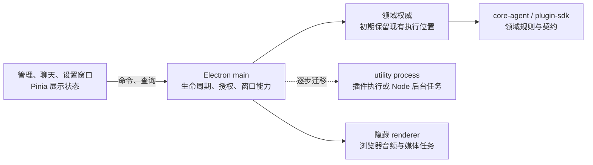

建议采用**“先明确领域所有权，再选择性迁移执行进程”**的方向：沿用现有插件宿主、Eventa 和 `core-agent`，先统一插件管理契约、收敛多窗口状态权威；随后按后台任务的实际依赖，引入独立执行进程。暂时没有足够依据把整个桌面应用改成客户端—服务器架构。

评估基于当前提交 `5228f9412` 的实现、配置、测试和历史。静态边界判断置信度较高；性能、跨平台恢复行为和真实并发故障尚未实测。本次未修改文件、安装依赖、创建提交或改变外部状态。

**现有架构已经有可用接缝，但所有权尚未完全收敛。**

| 已核实事实与证据 | 对决策的影响 |
|---|---|
| 主进程使用 injeca 装配窗口、插件宿主、频道服务器、MCP 等服务。[桌面入口](/evaluation-path/repository/apps/stage-tamagotchi/src/main/index.ts:154) | 可以沿现有组合根渐进调整，不必另建通用服务框架。 |
| 插件调试页通过共享 store 的 `setBridge()` 接入桌面操作；但插件快照、会话等类型在共享 store 和桌面契约中重复定义。[共享 store](/evaluation-path/repository/packages/stage-ui/src/stores/devtools/plugin-host-debug.ts:5)、[桌面契约](/evaluation-path/repository/apps/stage-tamagotchi/src/shared/eventa/plugin/host.ts:55) | UI bridge 值得保留；重复契约会使管理界面的扩展跨越多个所有者。 |
| `enabled` 是持久配置，`loaded` 是运行状态。当前 `setEnabled(false)` 会撤销资源访问，但没有调用插件停止流程。[宿主实现](/evaluation-path/repository/apps/stage-tamagotchi/src/main/services/airi/plugins/host/index.ts:447) | 产品界面的“禁用”必须先定义语义，不能直接把现有配置开关解释成“立即停止”。 |
| 聊天按窗口初始路由分配 authority／follower／client；权威在主窗口 renderer，自定义 BroadcastChannel 承载命令、响应和快照。[生命周期](/evaluation-path/repository/apps/stage-tamagotchi/src/renderer/stores/chat-sync-lifecycle.ts:19)、[同步协议](/evaluation-path/repository/apps/stage-tamagotchi/src/renderer/stores/chat-sync.ts:80) | 已有单权威设计，可继续演进；但协议与业务执行、窗口角色绑定在同一个 store 内。 |
| `core-agent` 已提供聊天编排运行时及 session、LLM、stream 接口；Pinia store 负责连接这些接口。[现有接入](/evaluation-path/repository/packages/stage-ui/src/stores/chat.ts:172) | 后台迁移应复用这一边界，不应重新抽象一套聊天引擎。 |
| 聊天 session store 同时管理内存状态、持久化队列、云同步和 outbox；存储使用 IndexedDB。[session store](/evaluation-path/repository/packages/stage-ui/src/stores/chat/session-store.ts:50)、[存储实现](/evaluation-path/repository/packages/stage-ui/src/database/storage.ts:1) | 编排可以脱离 Vue，不代表整条聊天流程已经能直接运行在 Node 后台。 |
| BeatSync 运行在隐藏 BrowserWindow，检测器使用 `AudioContext` 和媒体捕获。[后台窗口](/evaluation-path/repository/apps/stage-tamagotchi/src/main/windows/beat-sync/index.ts:10) | “后台能力”包含浏览器环境任务，不能统一搬到 Node 进程。 |

历史也支持这些判断：`0f975a4f7` 的 extension ID 统一涉及 29 个文件；`38f746055` 的聊天导入修复涉及同步协议、生命周期、桌面页面和共享组件。这是可检查的变更扩散证据，但不足以单独证明需要大规模拆包。

另一个需要区分的地方是**设计愿景与已实现能力**。插件架构文档描述了嵌入式、外部 Node、远程宿主三种部署；实际本地加载链是主进程中的 `ExtensionHost.start()` → 文件系统 loader → 动态 import。Node 侧 `createPluginContext()` 的若干传输分支仍明确抛出“未实现”。另一方面，SDK 已有 WebSocket channel 辅助函数，因此也不能说远程基础完全不存在。[架构文档](/evaluation-path/repository/packages/plugin-sdk/docs/design/architecture.md:173)、[当前传输实现](/evaluation-path/repository/packages/plugin-sdk/src/plugin-host/runtimes/node/index.ts:24)

**可行方向比较如下。**按这次需求，我暂将状态一致性和维护成本放在首位，其次是故障恢复与插件信任边界；性能和常驻资源占用需要先建立基线。

| 方向 | 所有权与收益 | 成本、风险及推翻条件 |
|---|---|---|
| A：局部延伸现状 | 插件宿主留在 main，聊天权威留在主 renderer；补管理界面和同步契约。成本低。 | 仍依赖主 renderer 存活。若需求仅是托盘隐藏后继续运行，这个方向可能足够。 |
| **B：应用拥有生命周期，按领域选择执行位置** | main 管理窗口、权限和后台执行生命周期；UI 消费权威状态；可把插件执行或 Node 适用任务逐步放入 utility process。 | 增加 IPC、恢复和打包验证成本。若后台独立性没有产品收益，且资源开销明显，应停在 A。 |
| C：独立 Node／远程宿主 | 桌面成为 viewer，支持独立运行和跨设备连续性。 | 需要认证、持久化、重连、版本协商和独立运维。只有“桌面退出后继续执行”或明确跨设备需求，才足以支付这些成本。 |

推荐 **A → B**。Electron 41.2.1 官方文档确认 utility process 提供 Node 环境、消息端口及退出事件，适合后台执行试点；它应由桌面监督，不应直接被当作“应用退出后仍常驻”的承诺。[版本对应官方文档](https://github.com/electron/electron/blob/v41.2.1/docs/api/utility-process.md)

建议的所有权关系是：

具体边界建议：

- **插件管理**：持久启用意图、发现结果、运行会话、权限授予分别建模。沿现有 bridge 增加产品操作和状态查询，调试检查仍保留独立语义。管理契约放在插件领域拥有的中立入口；优先扩展现有 SDK／protocol，先不新增包。桌面 Eventa 契约仅绑定传输。
- **共享包**：`stage-pages` 负责页面组合，`stage-ui` 负责展示状态和 Vue 接入，`core-agent` 继续拥有编排规则；Electron 窗口、cookie、文件发现和 OS 能力由桌面宿主持有。当前 SDK 的 web 入口仍导出引入 Node loader 的 core，需先整理 loader 所有权及包 exports，再让共享 UI 引用宿主相关契约。不能靠叶子 import 或 tsconfig 绕过这一链路。
- **多窗口**：按领域指定唯一写入者，窗口保留只读投影和本地交互状态。聊天窗口当前会保留自己的会话选择，这应继续保留。需要加强的是权威身份、状态修订和请求生命周期，不是广播整个 Pinia。
- **后台任务**：分开判断“隐藏窗口时继续”“renderer 重载后继续”“应用退出后继续”。前两种可以在 B 内解决；第三种需要 C 或明确的独立常驻程序。媒体捕获继续使用浏览器环境；Node 任务通过现有领域接口接入。

插件权限还有一个实质限制：宿主默认会以 manifest 请求作为授权来源，本地插件代码又是在宿主进程内执行。SDK 权限检查约束的是 SDK 调用，不能据此推断插件无法直接使用 Node。进程隔离可以缩小崩溃影响，但也不等于恶意代码沙箱。是否接受第三方不可信插件，是会改变方案的产品决定。Electron 官方要求对 IPC 来源进行验证、限制不可信内容能访问的 API；已有导航保护值得保留，新增宿主边界应延续这些约束。[41.2.1 安全文档](https://github.com/electron/electron/blob/v41.2.1/docs/tutorial/security.md)

渐进迁移与验证可以分为五步：

1. **先固定行为契约和基线。**记录各领域写入者、持久化位置、窗口角色和关闭语义。用现有导入、重试、会话选择及插件启停测试作为基线；补充复现并发启停、权威重载、延迟响应的最小测试。记录启动时间、窗口内存、快照体积及同步延迟，暂不虚构性能预算。

2. **统一插件契约和生命周期。**去除重复类型，从领域拥有的中立入口导出；明确“禁用是否停止”。同一扩展的启停、自动重载和关闭使用统一状态转换，所有状态变更从宿主发布，管理页和工具列表消费同一版本。当前关闭处理异步调用 `dispose()`，而内部 dispose 没有遍历停止插件会话；应验证并收敛为可等待的退出流程。验收覆盖 setup 失败、停止失败、资源撤销及重复 dispose。此阶段保持原执行位置和存储格式，可按模块回退。

3. **收敛窗口协议与启动职责。**沿已有 Eventa 用法替换手写请求／响应机制，同时保留领域级超时、身份与去重规则。当前接收路径未按 authority 身份过滤快照和响应，心跳还会触发 follower 请求快照；应先测试权威换代、旧响应和广播规模，再调整。把 `App.vue` 中的能力发布、工具刷新和初始化按固定窗口角色组织，避免多个窗口隐含承担同一后台责任。验收要求一个命令只产生一次业务效果，窗口重开能恢复，销毁时所有 pending 请求结束。

4. **只迁移一个后台执行单元。**优先试点插件执行，或一个不依赖 DOM／IndexedDB 的任务。main 保留窗口和授权能力，子进程承载执行，通过 Eventa 契约通信。需要先验证锁定的 Eventa `beta.8` 如何接入 utility process；已安装 Skill 没有证明存在可直接使用的对应 adapter。故障测试覆盖子进程崩溃、启动失败、超时、任务取消和应用退出，跨 Windows／macOS／Linux 验证打包与路径行为。切换时保证只有一个执行者；回退先停止新执行者，再恢复旧路径。

5. **以明确需求触发持久化或独立宿主迁移。**只有任务必须跨 renderer／应用重启延续，才进一步处理任务持久化和存储执行位置。保留已有 outbox、tombstone、账号隔离及去重语义；指定唯一云同步消费者。持久化迁移必须有可恢复快照、显式 schema 版本和回退程序，不能长期双写或静默添加兼容回退。远程宿主、通用任务总线、CRDT 和所有 store 的统一复制层均可延后。

后续验证应同时检查领域行为与真实模块边界：SDK 条件 exports、浏览器构建是否引入 Node 模块、真实多窗口通信，以及后台崩溃后的恢复。现有 Vitest 测试可以承接大部分回归；涉及 BroadcastChannel、媒体和窗口生命周期的结论还需要浏览器或 Electron 场景验证。实现完成后运行受影响工作区检查，再执行根 `pnpm typecheck`、`pnpm lint`；根脚本实际名是 `typecheck`。本次只读评估未运行这些可能生成缓存或产物的命令，也没有宣称测试通过。

技术依据使用了仓库的 `eventa`、`vue`、`vue-best-practices` Skills：Eventa Skill 自述作者为 moeru-ai、版本 1.0.0，仓库依赖为 `1.0.0-beta.8`，因此只采用已被仓库用法支持的指导；Vue Skill 标明源自官方文档、面向 Vue 3.5，与锁定的 3.5.32 相符；Vue Best Practices 来自 `vuejs-ai` 社区同步来源，作为状态与组件职责指导。Electron 覆盖缺口使用了维护方 **41.2.1** 官方文档。另需在迁移前核对 `electron-eventa` 声明的 `>=39 <41` peer 范围与当前 Electron 41.2.1 的适配情况，不能只修改范围便视为验证完成。

最终影响方向的未决输入只有三个：**后台需要存活到哪种生命周期、插件的信任等级、是否需要跨设备共享同一权威**。按当前信息，先收敛契约和所有权，再做单一后台试点，是成本和可逆性最合适的选择。

[EVAL:evolve-software-architecture-loaded]