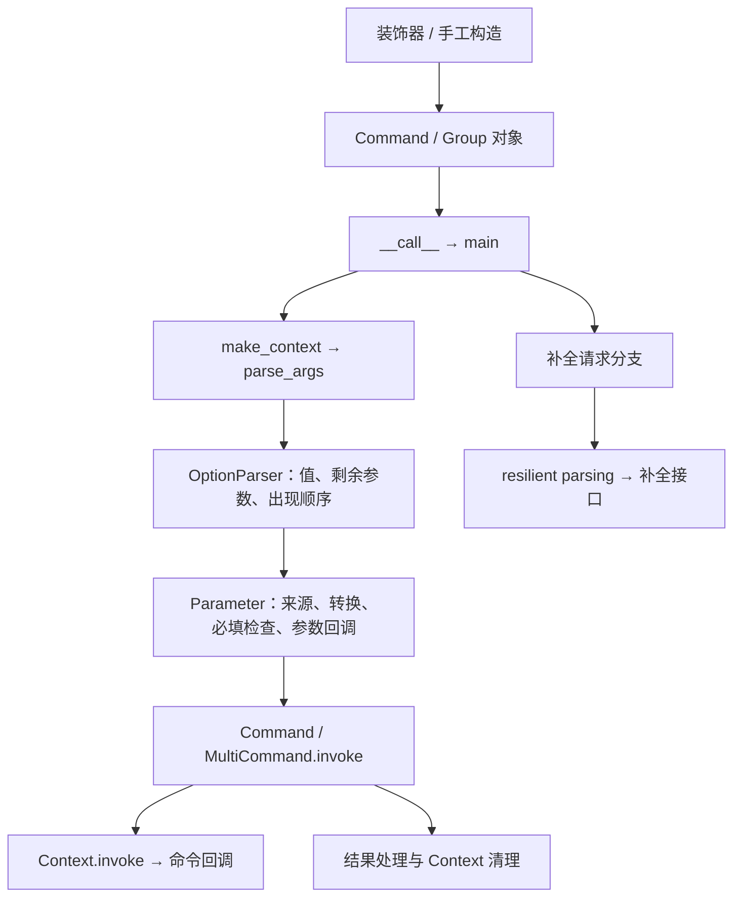

建议长期采用**稳定公开 API 与子类扩展点，逐步分离内部解析、调用编排和进程退出策略**的方向。当前证据支持渐进收拢职责；全面替换解析器或引入独立执行引擎的收益尚未成立。

评估针对仓库提交 `934813e`，版本标识为 **8.1.8**，不是对上游最新版的判断。使用了 `evolve-software-architecture` Skill；缺少适用的 Python／Click 技术栈 Skill，按你的授权采用本仓库维护方 `docs`，并与实现、测试及历史交叉核对。全程未修改文件、安装依赖、创建提交或改变外部状态。

当前公开边界比顶层导出更宽，兼容性评估应覆盖以下几层：

| 边界 | 可检查事实 | 架构含义 |
|---|---|---|
| 顶层门面 | `click` 重导出命令、参数、装饰器、类型、异常和终端工具。[源码](/evaluation-path/repository/src/click/__init__.py:8) | 内部整理要保留导入路径、对象身份、签名和类型推断。 |
| 子模块 API | API 文档还列出 `click.core.ParameterSource`、`click.decorators.pass_meta_key`、补全与测试接口。[文档](/evaluation-path/repository/docs/api.rst:104) | `__init__.py` 不能作为唯一公开 API 清单。 |
| 继承与定制 | 命令继承链是 `BaseCommand → Command → MultiCommand → Group / CommandCollection`；已有自定义 Context、Formatter、Command、Group 测试。[测试](/evaluation-path/repository/tests/test_custom_classes.py:4) | 覆盖方法、类属性和 `super()` 调用顺序也是兼容边界。 |
| 解析器 | `OptionParser` 被顶层导出、列入 API 文档，但自身说明称它是内部类、不建议直接使用。[实现](/evaluation-path/repository/src/click/parser.py:255) | 这是公开范围与设计意图的不一致；需要明确政策，不能仅凭“internal”直接替换。 |
| 命令发现 | `list_commands/get_command` 支撑普通 Group、命令集合和延迟加载；命令集合按来源顺序采用首个匹配命令。[实现](/evaluation-path/repository/src/click/core.py:1986) | 已有真实扩展缝隙，新增插件注册体系应先证明现有接口不足。 |

实际调用链如下。这里的“解析”包含参数转换与参数回调，并不是纯字符串处理：

不同调用入口有实质性的语义差别：

| 入口 | 当前行为 |
|---|---|
| `command(...)`／`main()` | 完整 CLI 路径；默认处理错误并退出，正常回调返回值不充当退出码。 |
| `main(standalone_mode=False)` | 正常返回回调结果；显式 `ctx.exit(n)` 返回整数 `n`。补全分支仍直接退出；`EOFError/KeyboardInterrupt` 仍转换为带原异常原因的 `Abort`。 |
| `make_context()` 后 `command.invoke(ctx)` | 前者解析，后者调用；调用者负责上下文作用域与错误处理。Group 的 `invoke` 还负责子命令编排。 |
| `ctx.invoke(command, **kwargs)` | 创建子上下文，补齐并转换缺省值，直接调用目标 callback；显式值原样传递，跳过完整参数解析、必填检查和参数回调。 |
| `ctx.forward(command)` | 将当前 `ctx.params` 补入调用参数，再走 `Context.invoke`。 |

这些区别来自 [main 实现](/evaluation-path/repository/src/click/core.py:1065) 和 [Context.invoke/forward](/evaluation-path/repository/src/click/core.py:737)。内存探针也确认：显式传入 `"invalid"` 可经 `Context.invoke` 到达整数参数的 callback，而 CLI 解析会拒绝它；`return 7` 与 `ctx.exit(7)` 在非 standalone 模式下都得到整数 `7`。因此调用入口的名称相近，并不意味着可以统一成同一种执行语义。

状态所有权基本合理：命令对象持有可变定义与配置，Context 持有本次调用的参数、剩余参数、来源和资源；父子 Context 继承 `obj`、共享 `meta`；当前上下文通过线程本地栈访问。文档明确限制跨线程修改 Context。[说明](/evaluation-path/repository/docs/advanced.rst:349) 命令发现与回调属于同进程调用边界；示例延迟加载直接导入 Python 模块，意味着扩展代码也在该进程执行。[示例](/evaluation-path/repository/examples/complex/complex/cli.py:31)

最值得处理的是以下三处职责交叉，而不是单纯缩短 `core.py`：

- **参数定义与解析顺序依赖对象身份。** 8.1.8 缓存帮助参数，是为了避免重复构造导致 eager 回调优先级失效；已有明确回归测试。这说明内部提取不能随意复制参数对象。[实现及原因](/evaluation-path/repository/src/click/core.py:1296)、[回归测试](/evaluation-path/repository/tests/test_commands.py:371)
- **上下文创建与资源生命周期存在失败缝隙。** `make_context` 用 `scope(cleanup=False)` 执行解析；探针复现了参数回调注册清理函数后抛错、清理未执行的路径。另一方面，chain 会先关闭各子命令 Context，再执行汇总结果回调，这是已有文档行为。前者适合单独修复，后者应纳入兼容验证。[创建路径](/evaluation-path/repository/src/click/core.py:937)、[chain 生命周期说明](/evaluation-path/repository/docs/commands.rst:415)
- **补全与测试隔离都不是纯查询。** 补全解析仍会执行参数回调，探针观察到 `resilient_parsing=True`；帮助和补全还会触发延迟加载。`CliRunner` 则替换流、环境变量及模块函数，文档明确限定单线程；历史提交 `ffd43e9` 修复过遗漏恢复的补丁。[参数处理](/evaluation-path/repository/src/click/core.py:2395)、[延迟加载说明](/evaluation-path/repository/docs/complex.rst:336)、[运行器约束](/evaluation-path/repository/src/click/testing.py:160)

长期方向可以比较为：

| 方向 | 收益 | 成本与取舍 | 适用条件 |
|---|---|---|---|
| 保留当前结构，持续局部修复 | 迁移成本最低，扩展生态风险小 | 调用、解析和生命周期知识仍集中，跨边界修复继续依赖维护者经验 | 若相关缺陷少、修改能保持局部，这是合理基线。 |
| **保留公开对象，内部按职责提取** | 明确解析结果、调用编排和进程策略的所有权；改善故障定位和局部验证 | 必须保留覆盖钩子、对象身份及调用顺序；过多转发层会抵消收益 | **当前推荐。** 每一步应证明职责更清晰、变更更局部。 |
| 不可变命令规格＋独立执行引擎 | 可服务序列化、多前端或多种执行模型 | 可变 `params`、动态发现、Context、副作用 callback 和继承扩展都需要适配，迁移成本最高 | 只有出现明确且现有扩展点无法承接的消费者需求时再评估。 |

建议优先级为：**行为与扩展兼容性 → 生命周期可靠性与修改局部性 → 启动成本和平台兼容性**。这是本评估的排序建议，尚无下游使用统计或性能预算。仓库要求 Python ≥3.7，已有轻量导入测试和跨平台 CI，方案应沿用这些约束。[项目配置](/evaluation-path/repository/pyproject.toml:15)、[导入测试](/evaluation-path/repository/tests/test_imports.py:57)

渐进迁移与验证建议分五步：

1. **先建立契约清单与行为基线。** 汇总顶层、文档化子模块及子类钩子，明确 `OptionParser` 的兼容政策。记录各调用入口的值、异常、退出、callback 顺序和清理顺序；修正文档中容易被理解为“完全无异常处理／无副作用”的描述。完成标准是关键入口均有明确语义和行为断言。

2. **提取最小的内部职责，保留公开类定义与动态分派。** 优先明确 token 解析结果与参数处理的交接，再提取共用编排逻辑。`make_parser`、`add_to_parser`、`get_command` 等覆盖路径继续参与执行；参数对象保持身份。正常执行和补全共享发现能力，各自保留处理策略。每次只迁移一个职责，行为轨迹无差异后继续；回滚到原方法实现即可。

3. **单独修复生命周期失败路径。** 针对解析阶段注册资源后失败、清理函数抛错、chain 后续命令解析失败增加回归用例。明确“创建中的 Context 由谁清理”，同时验证上下文栈恢复及原始异常保留。这属于行为修复，应独立说明、独立发布与回滚，避免混入结构整理。

4. **收拢进程退出策略，保留现有入口语义。** 逐步将补全退出、错误展示、Abort 和 EPIPE 策略集中到内部边界。用回归验证保护 `main(False)` 的历史行为。若未来需要可区分“返回值／显式退出／失败”的结构化结果，先提出增量接口；已有 `to_info_dict` 可继续承担命令信息读取，规格化引擎需要另行证明需求。

5. **以代表性消费者和现有矩阵验收。** 自定义 Group／Context／ParamType、别名、命令集合及延迟加载示例应作为迁移样本；延迟加载逐个运行子命令 `--help`。完成标准包括消费者无需修改、兼容用例无差异、解析失败资源按新契约清理，以及启动成本满足迁移前确定的预算。

验证重点应覆盖：

- 参数来源优先级、重复选项、eager 顺序、未知选项转发及剩余参数。
- 普通／嵌套／chain 调用、`invoke/forward`、结果回调、返回值与退出码。
- 正常、错误、显式退出及清理失败时的资源关闭和上下文恢复。
- Bash／Zsh／Fish 补全、参数回调副作用、延迟加载触发及隐藏命令。
- `CliRunner` 异常后的全局状态恢复；真实进程退出用子进程验证。
- 仓库现有 Python、Windows、macOS、PyPy 矩阵，以及 mypy、pyright、公开类型检查和文档构建。[CI](/evaluation-path/repository/.github/workflows/tests.yaml:15)、[验证配置](/evaluation-path/repository/tox.ini:1)

本次执行了加载本地源码、关闭字节码写入的内存探针，未运行完整 pytest／tox，因此这些结果用于确认边界，不能替代迁移后的完整验收。异步核心、插件隔离、不可变规格和解析器替换均应等待明确需求；下游覆盖钩子的使用程度、补全副作用依赖以及实际启动预算，是下一轮决策最重要的未知项。

[EVAL:evolve-software-architecture-loaded]